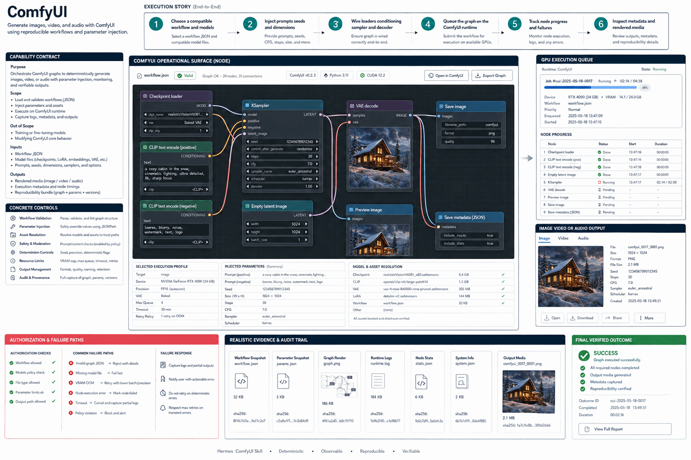

# How ComfyUI Works

Generate images, video, and audio with ComfyUI using reproducible workflows and parameter injection.

## Stages

### 1. Choose a compatible workflow and models

**Primary surface:** `Prompt and source assets`

Record the input, operation, observable output, and any decision that changes scope. Stop here if the output is missing, contradictory, or insufficient for the next stage.
### 2. Inject prompts seeds and dimensions

**Primary surface:** `Model and sampler nodes`

Record the input, operation, observable output, and any decision that changes scope. Stop here if the output is missing, contradictory, or insufficient for the next stage.
### 3. Wire loaders conditioning sampler and decoder

**Primary surface:** `Conditioning graph`

Record the input, operation, observable output, and any decision that changes scope. Stop here if the output is missing, contradictory, or insufficient for the next stage.
### 4. Queue the graph on the ComfyUI runtime

**Primary surface:** `GPU execution queue`

Record the input, operation, observable output, and any decision that changes scope. Stop here if the output is missing, contradictory, or insufficient for the next stage.
### 5. Track node progress and failures

**Primary surface:** `Image video or audio output`

Record the input, operation, observable output, and any decision that changes scope. Stop here if the output is missing, contradictory, or insufficient for the next stage.
### 6. Inspect metadata and rendered media

**Primary surface:** `Image video or audio output`

Record the input, operation, observable output, and any decision that changes scope. Stop here if the output is missing, contradictory, or insufficient for the next stage.

## Failure handling

- **Authorization failure:** do not probe credentials or broaden access; report the missing authority.
- **Target ambiguity:** stop before mutation and request the minimum identifying information.
- **Tool or service failure:** retain error evidence, retry only safe transient failures, and cap retries.
- **Verification failure:** classify the run as incomplete even when the preceding operation returned success.

## Completion evidence

The handoff should contain the original request, inspection state, preview or plan, exact execution result, direct verification, and a final receipt naming limitations and withheld actions.
