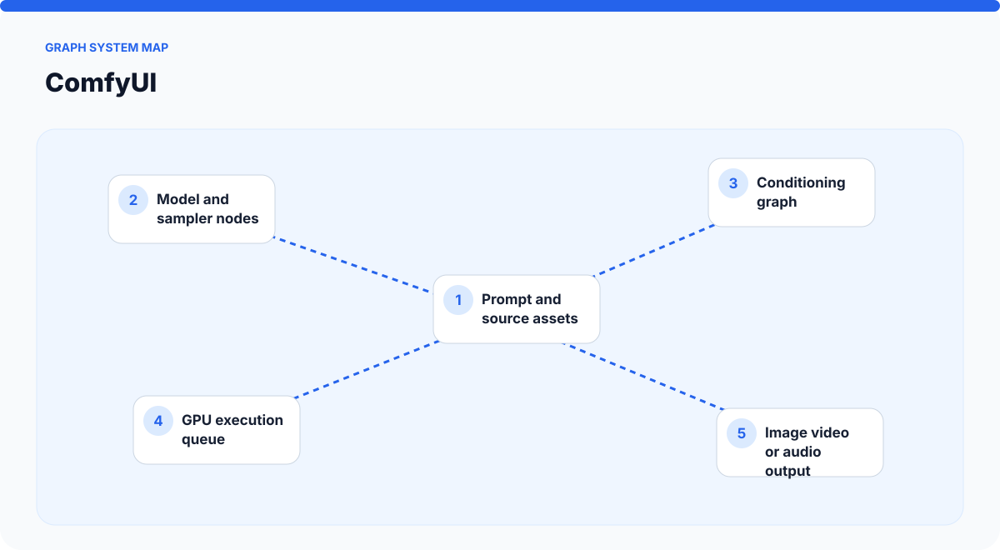
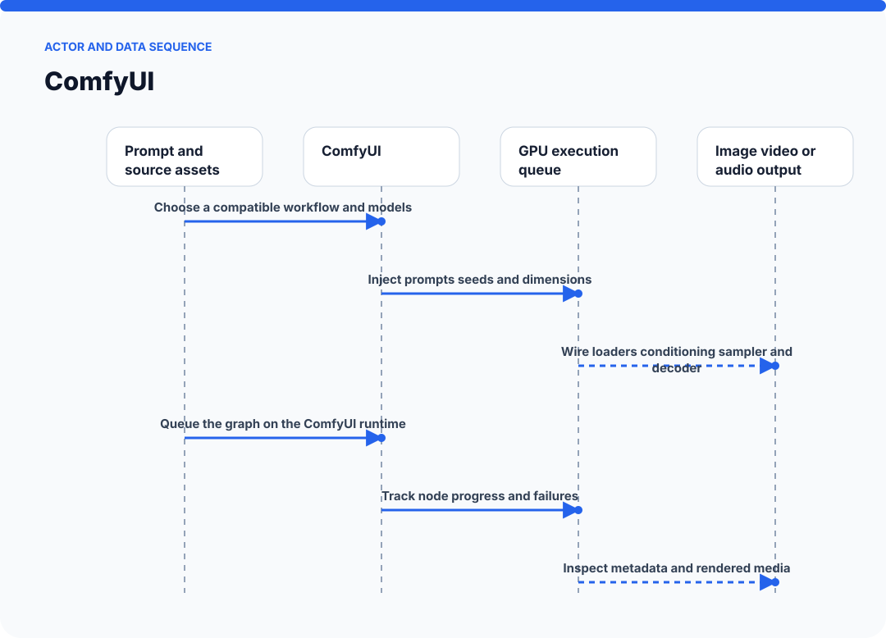
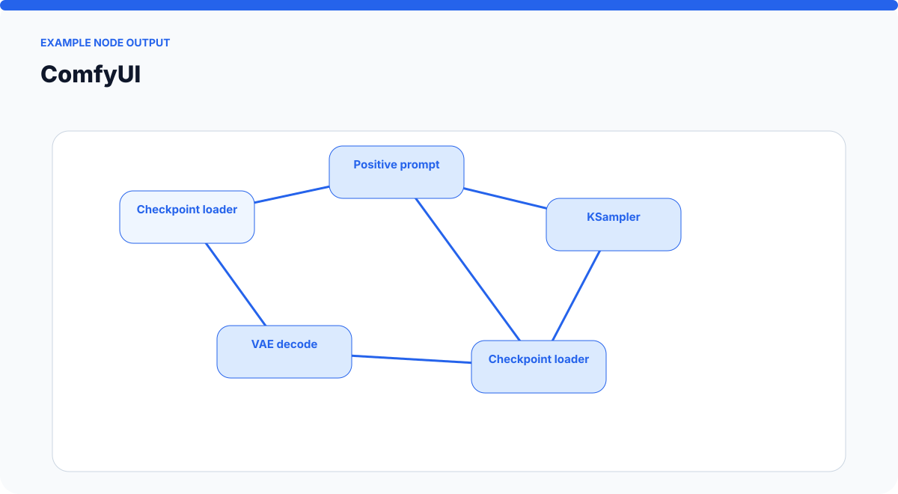
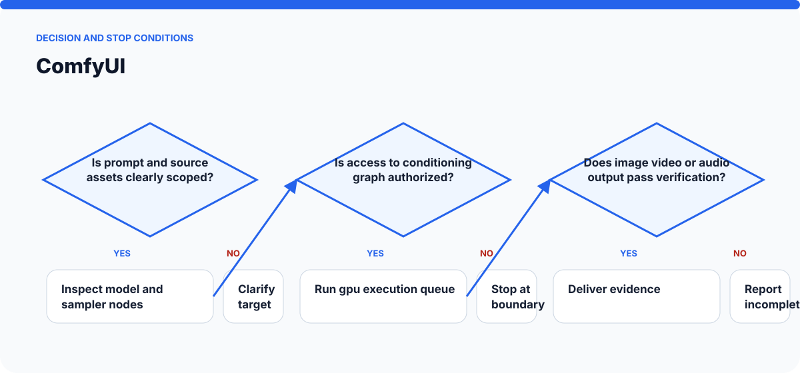

# How ComfyUI Works

The visuals on this page are static SVGs, so they render directly on GitHub on phones and desktop browsers. Each one is generated from a model specific to this skill.

## System architecture

### Components

- **1. Prompt and source assets:** participates in choose a compatible workflow and models.
- **2. Model and sampler nodes:** participates in inject prompts seeds and dimensions.
- **3. Conditioning graph:** participates in wire loaders conditioning sampler and decoder.
- **4. GPU execution queue:** participates in queue the graph on the comfyui runtime.
- **5. Image video or audio output:** participates in track node progress and failures.

## Actor and data sequence

### 1. Choose a compatible workflow and models

**Primary surface:** `Prompt and source assets`

Record the concrete input, the operation performed, and the evidence produced at this stage. Continue only when the output is sufficient for the next stage; otherwise preserve the blocker and stop.
### 2. Inject prompts seeds and dimensions

**Primary surface:** `Model and sampler nodes`

Record the concrete input, the operation performed, and the evidence produced at this stage. Continue only when the output is sufficient for the next stage; otherwise preserve the blocker and stop.
### 3. Wire loaders conditioning sampler and decoder

**Primary surface:** `Conditioning graph`

Record the concrete input, the operation performed, and the evidence produced at this stage. Continue only when the output is sufficient for the next stage; otherwise preserve the blocker and stop.
### 4. Queue the graph on the ComfyUI runtime

**Primary surface:** `GPU execution queue`

Record the concrete input, the operation performed, and the evidence produced at this stage. Continue only when the output is sufficient for the next stage; otherwise preserve the blocker and stop.
### 5. Track node progress and failures

**Primary surface:** `Image video or audio output`

Record the concrete input, the operation performed, and the evidence produced at this stage. Continue only when the output is sufficient for the next stage; otherwise preserve the blocker and stop.
### 6. Inspect metadata and rendered media

**Primary surface:** `Prompt and source assets`

Record the concrete input, the operation performed, and the evidence produced at this stage. Continue only when the output is sufficient for the next stage; otherwise preserve the blocker and stop.

## Example output shape

The example is a visual contract: a real run may look different, but it should expose comparable state, provenance, and verification information. It is not presented as evidence of a live external action.

## Decision and stop conditions

The workflow stops when the target is ambiguous, the relevant surface is unavailable or unauthorized, or the final artifact cannot be checked. A logged-in session or successful tool call is not by itself proof that the requested outcome is complete.

## Verification checklist

- Confirm every component shown in the system map exists in the target environment.
- Trace the actor sequence using actual tool output or artifact state.
- Compare the result with the example-output information contract.
- Re-read or reopen the final artifact instead of trusting an attempt message.
- Report omitted stages, unsupported capabilities, and remaining human decisions.
